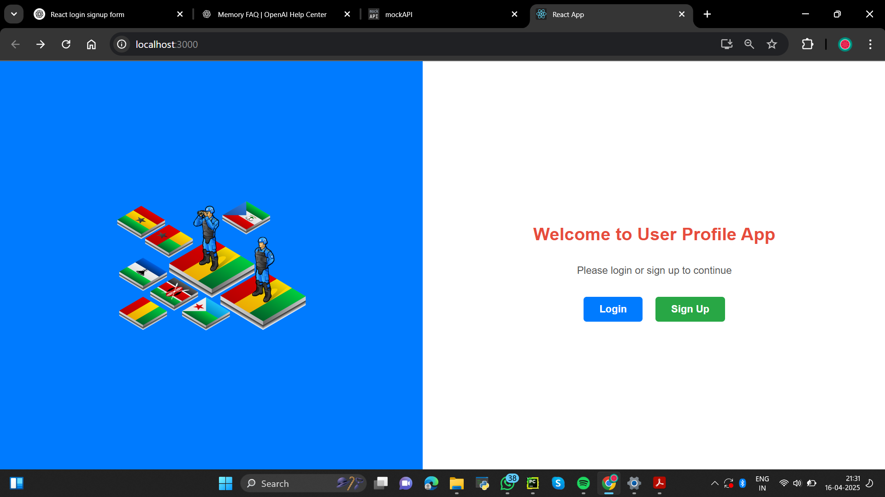
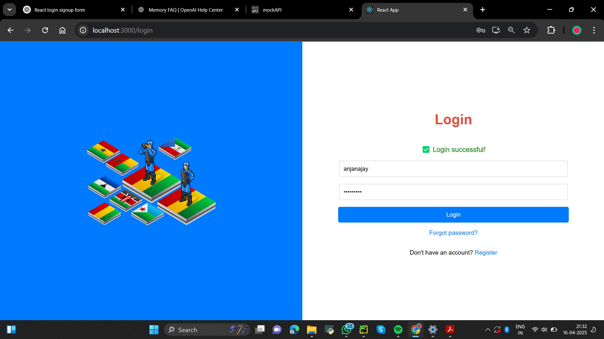
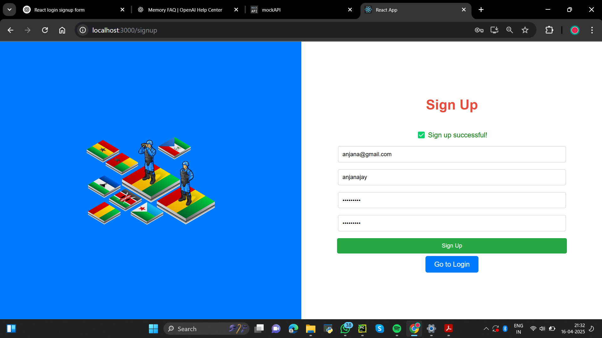

# 🚀 Simple User Authentication UI – React JS

A clean and responsive **Login / Sign Up UI** built using **React JS**. This project demonstrates basic component-based design, conditional rendering, and simple state management using React hooks.

---

## 🖼️ Features

- ✨ Split-screen layout with illustrations
- 🔐 Login and Sign Up forms with validation
- ✅ Success messages on actions
- 🔁 Switch between forms (Login ⇄ Sign Up)
- 🎨 Styled using basic inline CSS (easy to customize)

---

## 📸 Screenshots

### 🏠 Home Page

### 🔐 Login Page

### 📝 Sign Up Page

---

## 🛠️ Tech Stack

- [React JS](https://reactjs.org/)
- React Router (for navigation)
- Basic React Hooks (`useState`)
- Inline styling (customizable)

---

